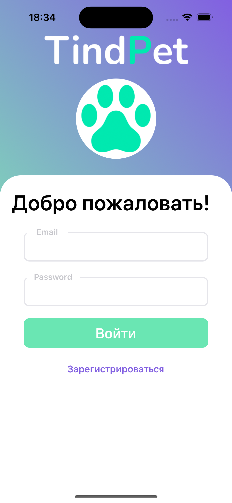
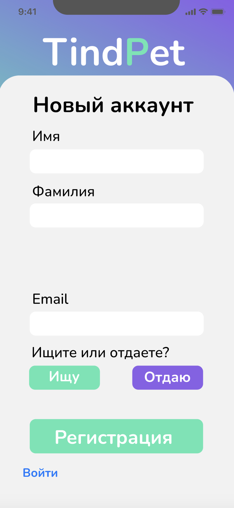
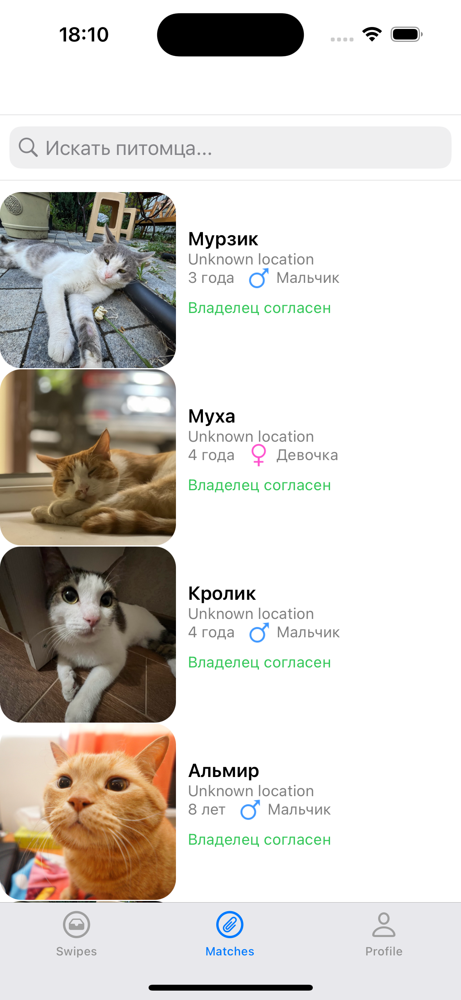
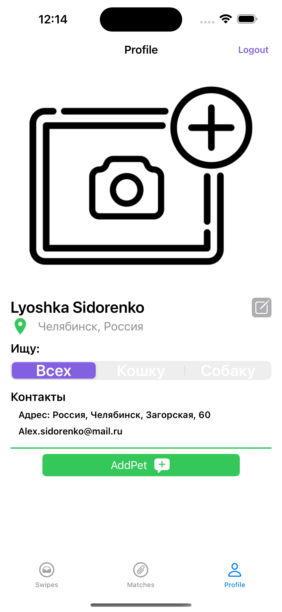
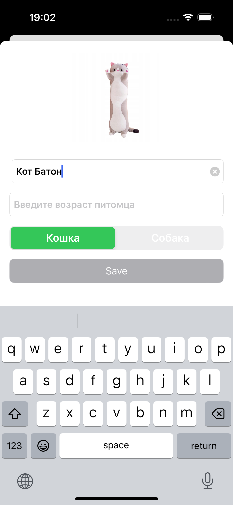

# TindPet App
 

        
## ОПИСАНИЕ

TindPet - приложение, которое поможет найти для вашего питомца новый дом или же наоборот, Вам найти нового питомца.
  

  
## Скриншоты
### Регистрация
<h1 align="center">
     
</h1>

### Swipes
<h1 align="center">
     
</h1>

### Matches
<h1 align="center">
     
</h1>

### Profile
<h1 align="center">
     
</h1>

### Добавление питомца
<h1 align="center">
     
</h1>

## Функции

* регистрация аккаунта на внешнем сервере `Firebase`
* регистрация как отдающего, так и как принимающего животное аккаунта

## В разработке

* возможность ставить `Like` и `Dislike` животным
* создание профиля животного
    
## Стек и архитектура

- В качестве архитектуры была выбрана `MVP`
- Верстка - `UIKit`, без сторонних библиотек
- Работа с сетью осуществляется с помощью `Firebase`

## Требования

- iOS 15.0+
- Xcode 14.2

## Дизайн

### Вы можете посмотреть отрисованный дизайн приложения в Figma  
[TindPet-Figma](https://www.figma.com/file/5wNyRqYbv95DOEjCKtkbvn/TindPet1?type=design&node-id=0-1&mode=design&t=vfZR2rcoQZCWXfxy-0)

## Наша iOS команда

<a href="https://github.com/DarkHedgehog">Александр</a>\
<a href="https://github.com/asya-gun">Анастасия</a>\
<a href="https://github.com/ArturKondratev">Артур</a>\
<a href="https://github.com/Lyoshka999">Алексей</a>

